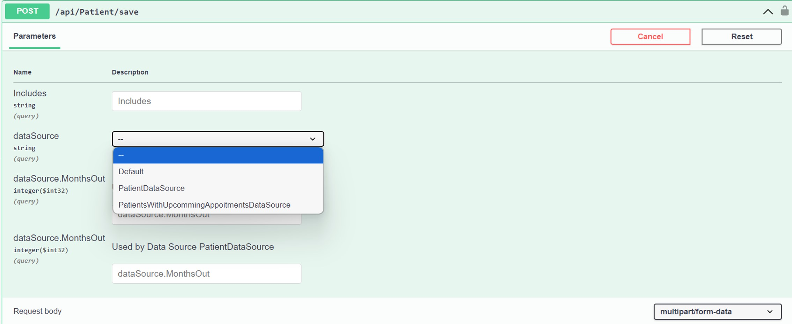

# OpenAPI/Swagger

When using Coalesce to generate API endpoints, the default OpenAPI generation _(sometimes referred to as its pre-2015 name "Swagger")_ can sometimes result in verbose and confusing API definitions, especially when dealing with DataSources and Behaviors. To address these issues, the `IntelliTect.Coalesce.Swashbuckle` package offers enhancements for OpenAPI definitions, making your Coalesce-generated APIs clearer and more manageable.

## Document Generation Options

### Swashbuckle

The `IntelliTect.Coalesce.Swashbuckle` package is built on top of [Swashbuckle.AspNetCore](https://github.com/domaindrivendev/Swashbuckle.AspNetCore) and provides Coalesce-specific enhancements to the OpenAPI document generation. This is the recommended approach and is used by the Coalesce template.

#### Setup

##### 1. Add the NuGet Package

Add a reference to the `IntelliTect.Coalesce.Swashbuckle` NuGet package to your web project:

```xml:no-line-numbers{3}
<ItemGroup>
  <PackageReference Include="IntelliTect.Coalesce.Vue" Version="$(CoalesceVersion)" />
  <PackageReference Include="IntelliTect.Coalesce.Swashbuckle" Version="$(CoalesceVersion)" />
</ItemGroup>
```

Note: You do not need to install the `Swashbuckle.AspNetCore` package separately if you are using the Coalesce one.

##### 2. Configure Document Generation

Update your Program.cs file to configure OpenAPI document generation with Coalesce-specific enhancements:

```c#:no-line-numbers
builder.Services.AddSwaggerGen(config =>
{
    config.AddCoalesce(); // Add coalesce specific configuration
    config.SwaggerDoc("v1", new OpenApiInfo { Title = "My API", Version = "v1" });
});
```

##### 3. Enable Document Endpoint

Add the OpenAPI document endpoint in your HTTP pipeline:

```c#
app.MapSwagger();
```

#### Improvements

##### Default OpenAPI Generation

By default, OpenAPI in ASP.NET Core offers a simple way to document APIs. It generates API documentation based on the structure of your controller actions and data models. While this default setup is functional for many scenarios, it may fall short in representing more complex cases, especially when dealing with Coalesce-generated endpoints that include DataSources and Behaviors. These scenarios can lead to verbose and sometimes confusing OpenAPI documentation.

##### Coalesce Enhancements

The `IntelliTect.Coalesce.Swashbuckle` package addresses the limitations of the default OpenAPI generation by providing custom OpenAPI filters. These filters enhance the readability and usability of your OpenAPI documentation for Coalesce-generated APIs.

The primary effect is an adjustment of parameter definitions to account for Coalesce's custom model binders that create instances of Data Sources and Behaviors on each request. These parameters will be updated in the OpenAPI document to account for data source parameters, filter parameters, and other model-specific customizations.

##### Visual Comparison 

To illustrate the impact of the `IntelliTect.Coalesce.Swashbuckle` package, let's examine the Patient model and its representation in OpenAPI.

```c#
public class Patient
{
    public int PatientId { get; init; }
    public DateTime NextAppointment { get; set; }
    // Additional properties

    [DefaultDataSource]
    public class PatientDataSource(CrudContext<AppDbContext> context) : StandardDataSource<Patient, AppDbContext>(context)
    {
        // ...
    }

    public class PatientsWithUpcomingAppointmentsDataSource(CrudContext<AppDbContext> context) : StandardDataSource<Patient, AppDbContext>(context)
    {
        [Coalesce]
        public int MonthsOut { get; set; }

        // ...
    }
}
```

###### Without `IntelliTect.Coalesce.Swashbuckle`
In the default OpenAPI configuration, DataSource and Behavior parameters are represented as generic objects. DataSource names are also shown as plain strings, hindering the discoverability of available data sources.


###### With `IntelliTect.Coalesce.Swashbuckle`
With the `IntelliTect.Coalesce.Swashbuckle` package, OpenAPI can interpret the DataSource as a dropdown menu and provides individual fields for each DataSource property. Additionally, it eliminates unnecessary behavior parameters.


### Microsoft.AspNetCore.OpenApi

ASP.NET Core includes [built-in OpenAPI document generation](https://learn.microsoft.com/en-us/aspnet/core/fundamentals/openapi/aspnetcore-openapi) via `Microsoft.AspNetCore.OpenApi`. However, this package is **not recommended for use with Coalesce** until .NET 10 or later, as versions older than that contain a number of bugs.

Adding it is as simple as installing `Microsoft.AspNetCore.OpenApi`, then in Program.cs:

``` c#
services.AddOpenApi();
```

## UI Options

Once you have OpenAPI document generation configured, you need to choose a UI to display the documentation. The UI consumes the OpenAPI document and presents it in an interactive, human-readable format.

### Scalar

[Scalar](https://github.com/scalar/scalar) is a modern, interactive API documentation UI that provides an excellent developer experience. It is the default choice in the Coalesce template and offers:
- Clean, modern interface
- Interactive API testing
- Better performance
- Improved dark mode support

#### Setup

Add Scalar to your HTTP pipeline:

```c#
// With Swashbuckle:
app.MapScalarApiReference(c => c.OpenApiRoutePattern = "/swagger/{documentName}/swagger.json");

// With Microsoft.AspNetCore.OpenApi:
app.MapScalarApiReference();
```

Your API documentation will be available at `/scalar/v1` in development.

### Swagger UI

The traditional [Swagger UI](https://swagger.io/tools/swagger-ui/) is also fully supported and can be used instead of Scalar.

#### Setup

Add Swagger UI to your HTTP pipeline:

```c#
app.UseSwaggerUI(c =>
{
    c.SwaggerEndpoint("/swagger/v1/swagger.json", "My API V1");
});
```

Your API documentation will be available at `/swagger` in development.