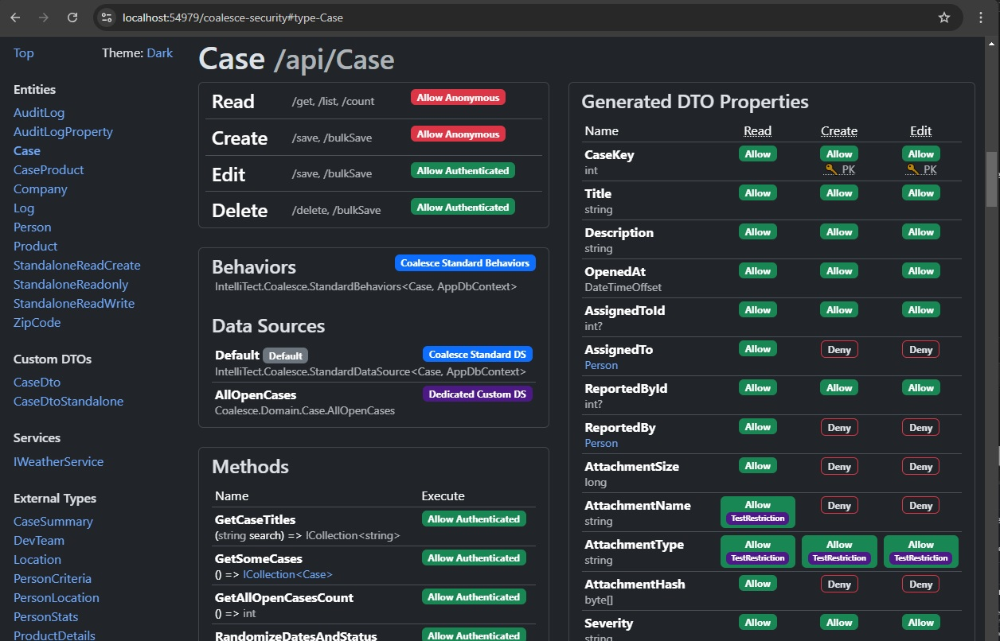

# Security

This page is a comprehensive overview of all the techniques that can be used in a Coalesce application to restrict the capabilities of API endpoints that Coalesce generates.

The following table is a quick reference of scenarios you might encounter and how you might handle them. If you're unfamiliar with these techniques, though, then you are encouraged to read through this page to get a deeper understanding of what's available before selecting a solution.

<table>
<thead>
<tr>
<th width=150px>Feature</th>
<th width=190px>Restriction</th>
<th>Technique</th>
</tr>
</thead><tbody>

<tr>
<td rowspan=4>

[CRUD](/modeling/model-types/crud.md) Reads:
`/get`, <br> `/list`, <br> `/count`
</td>
<td>Disable</td>
<td>

[[Read(DenyAll)]](#class-security-attributes)
</td>
</tr>

<tr>
<td>Roles</td>
<td>

[[Read("RoleName")]](#class-security-attributes)
</td>
</tr>

<tr>
<td>

Prevent
[auto-include](/modeling/model-components/data-sources.md#default-loading-behavior)

</td>
<td>

* Omit `base` call in Data Source `GetQuery` override.
* `[Read(NoAutoInclude = true)]` on properties or types.
* `[assembly: CoalesceConfiguration(NoAutoInclude = true)]`

</td>
</tr>

<tr>
<td>

Any custom code:
* Query Predicates
* Filtered Includes
* Conditional Includes
* Sort/search/filter overrides
</td>
<td>

[Custom Default Data Source](#data-sources)
</td>
</tr>


<!-- Blank TR to offset row striping -->
<tr></tr>

<tr>
<td rowspan=5>

[CRUD](/modeling/model-types/crud.md) Mutations:
`/save`, <br> `/bulkSave`, <br> `/delete`

</td>
<td>Disable</td>
<td>

[[Create(DenyAll)] [Edit(DenyAll)] [Delete(DenyAll)]](#class-security-attributes)
</td>
</tr>

<tr>
<td>Roles</td>
<td>

[[Create("Role")] [Edit("Role")] [Delete("Role")]](#class-security-attributes)
</td>
</tr>

<tr>
<td>Restrict target records (edit/delete)</td>
<td>

[Custom Default Data Source](#data-sources)
</td>
</tr>

<tr>
<td>Static Validation</td>
<td>

[Validation attributes](#attribute-validation)
</td>
</tr>

<tr>
<td>

Any custom code:
* Security
* Validation

</td>
<td>

[Custom Behaviors](#behaviors)
<br>


</td>
</tr>

<tr>
<td rowspan=5>

[Methods](/modeling/model-components/methods.md) and [Services](/modeling/model-types/services.md)

</td>
<td>Disable</td>
<td>

N/A - explicit opt-in required via `[Coalesce]`
</td>
</tr>

<tr>
<td>Roles</td>
<td>

[[Execute("RoleName")]](#method-security-attributes)
</td>
</tr>

<tr>
<td>Static Validation</td>
<td>

[Validation attributes](#attribute-validation)
</td>
</tr>

<tr>
<td>

Restrict [instance methods](/modeling/model-components/methods.md#instance-methods) Targets
</td>
<td>

* [custom Default Data Source](#data-sources)
* specify data source:
[[Execute(DataSource = typeof(...))]](/modeling/model-components/attributes/execute.md#member-datasource)

</td>
</tr>

<tr>
<td>Other</td>
<td>

Write custom logic in the method.
</td>
</tr>


<tr>
<td rowspan=8>

[Properties](/modeling/model-components/properties.md)
<br>
<small style="display: block; line-height: 1.3">
(All input and output for Entity CRUD, Methods, and Services)
</small>

</td>
<td>Globally Exclude</td>
<td>

* [[InternalUse]](#internal-properties)
* `internal` access modifier
</td>
</tr>


<tr>
<td>
Roles
</td>
<td>

[Property Security Attributes](#role-restrictions)
</td>
</tr>

<tr>
<td>

Read-only

</td>
<td>

* `internal` setter or no setter
* `[Read]` attribute without `[Edit]`
* [other techniques](#read-only-properties)

</td>
</tr>
<tr>
<td>

Init-only (write-once)
</td>
<td>

[`init` setter](https://learn.microsoft.com/en-us/dotnet/csharp/language-reference/keywords/init)

</td>
</tr>

<tr>
<td>

Custom security
</td>
<td>

* Navigation Properties: [Data Sources](#data-sources)
* Scalar/Other Properties: [Property Restrictions](#custom-restrictions)

</td>
</tr>

</tbody></table>


## Endpoint Security

Coalesce generates API endpoints by traversing your data model's classes, starting from types annotated with `[Coalesce]`. This usually includes your `DbContext` class, as well as any [Service](/modeling/model-types/services.md) classes or interfaces.

Classes can be hidden from Coalesce entirely by annotating them with `[InternalUse]`, preventing generation of API endpoints for that class, as well as preventing properties of that type from being exposed.

`DbSet<>` properties on your `DbContext` class can also be annotated with `[InternalUse]`, causing that type to be treated by Coalesce like an [Simple Model](/modeling/model-types/simple-models.md) rather than an [Entity](/modeling/model-types/entities.md), once again preventing generation of API endpoints but _without_ preventing properties of that type from being exposed.

### Class Security Attributes

For each of your [CRUD Models](/modeling/model-types/crud.md), Coalesce generates a set of API endpoints (`/get`, `/list`, `/count`, `/save`, `/bulkSave`, and `/delete`).

The default behavior is that all endpoints require an authenticated user (anonymous users are rejected).

These endpoints can be secured by placing any or all of the [[Read], [Create], [Edit], and [Delete] attributes](/modeling/model-components/attributes/security-attribute.md) on the the class. Each attribute can specify required roles for that action, or open that action to anonymous, unauthenticated users, or disable the endpoint entirely.

This security is applied to the generated [controllers](https://learn.microsoft.com/en-us/aspnet/core/mvc/controllers/actions). The `[Read]` attribute on a class **_does not_** affect instances of that class when those instances are present as child properties of other types, since in those scenarios the data will be coming from a different endpoint on a different controller.

<table> 
<thead>
<tr>
<th>Endpoints</th>
<th>Governing Attributes</th>
</tr>
</thead><tbody>
<tr>
<td>

`/get`, `/list`, `/count`

</td>
<td>

```c#:no-line-numbers
[ReadAttribute]
```

</td>
</tr>
<tr>
<td>

`/save`

</td>
<td>

```c#:no-line-numbers
[CreateAttribute] // Affects saves of new entities
[EditAttribute]   // Affects saves of existing entities
```

</td>
</tr>
<tr>
<td>

`/delete`

</td>
<td>

```c#:no-line-numbers
[DeleteAttribute]
```

</td>
</tr>
<tr>
<td>

`/bulkSave`

</td>
<td>

```c#:no-line-numbers
// Read permission required for the root entity:
[ReadAttribute]

// Control of each entity affected by the bulk save:
[CreateAttribute]
[EditAttribute]
[DeleteAttribute]
```

</td>
</tr>
</tbody></table>

Here are some examples of applying security attributes to an entity class. If a particular action doesn't need to be restricted, you can omit that attribute, but this example shows usages of all four:

```c#:no-line-numbers
// Allow read access by unauthenticated, anonymous users:
[Read(SecurityPermissionLevels.AllowAll)]
// Allow creation of new entities by the Admin and HR roles (params string[] style):
[Create("Admin", "HR")]
// Allow editing of existing Employee entities by users with the Admin or HR roles (CSV style):
[Edit("Admin,HR")]
// Prohibit deletion of Employee entities
[Delete(SecurityPermissionLevels.DenyAll)]
public class Employee
{
    public int EmployeeId { get; set; }
}
```

### Method Security Attributes

To secure the endpoints generated for your [Custom Methods](/modeling/model-components/methods.md) and [Services](/modeling/model-types/services.md), the [[Execute] attribute](/modeling/model-components/attributes/execute.md) can be used to specify a set of required roles for that endpoint, or to open that endpoint to anonymous users.

The default behavior is that all endpoints require an authenticated user (anonymous users are rejected).

For example:

```c#:no-line-numbers
public class Employee
{
    public int EmployeeId { get; set; }

    [Coalesce, Execute("Payroll,HR")]
    public void GiveRaise(int centsPerHour) {
        // Only Payroll and HR users can call this method
    }

    [Coalesce, Execute(SecurityPermissionLevels.AllowAll)]
    public void SendMessage(string message) {
        // Anyone (even anonymous, unauthenticated users) can call this method.
    }
}
```

## Property/Column Security

Security applied to properties with attributes in Coalesce affects all usages of that property across all Coalesce-generated APIs. This includes usages of that property on types that occur as children of other types, which is a spot where class-level or endpoint-level security generally does not apply. [These attributes](/modeling/model-components/attributes/security-attribute.md) can be placed on the properties on your [Entities](/modeling/model-types/entities.md) and [Simple Models](/modeling/model-types/simple-models.md) to apply role-based restrictions to that property.

- `ReadAttribute` limits the roles that can read values from that property in responses from the server.
- `EditAttribute` limits the roles that can write values to that property in requests made to the server.
- `RestrictAttribute` registers an implementation of [IPropertyRestriction](#custom-restrictions) that allows for writing custom code to implement these restrictions.

This security is executed and enforced by the mapping that occurs in the [generated DTOs](/stacks/agnostic/dtos.md), meaning it affects both entity CRUD APIs as well as [Custom Methods](/modeling/model-components/methods.md). It is also checked by the [Standard Data Source](/modeling/model-components/data-sources.md#standard-data-source) to prevent sorting, searching, and filtering by properties that a user is not permitted to read.

### Internal Properties

Properties can be hidden from Coalesce entirely, either with the [[InternalUse]](/modeling/model-components/attributes/internal-use.md) attribute or non-public C# access modifiers.

The properties in the following example are hidden entirely from all Coalesce functionality and generated APIs:

```c#:no-line-numbers
using IntelliTect.Coalesce.DataAnnotations;
public class Employee
{
  // InternalUseAttribute hides anything from Coalesce.
  [InternalUse]
  public string Name { get; set; }

  // Non-public C# access modifiers will hide properties from Coalesce:
  internal decimal Salary { get; set; }

  // Property's type is [InternalUse], so properties using that type are also internal.
  public Department Department { get; set; }
}

[InternalUse]
public class Department
{
  // All properties on an [InternalUse] type are non-exposed,
  // since the parent type is not exposed.
  public string Name { get; set; }
}
```

### Read-Only Properties

A property in Coalesce can be made read-only in any of the following ways:

```c#:no-line-numbers
using IntelliTect.Coalesce.DataAnnotations;
using System.ComponentModel;
public class Employee
{
  // A property with a [Read] attribute but no [Edit] attribute is read-only:
  [Read]
  public string Name { get; set; }

  // Payroll users and HR users can read this property. Nobody can edit it:
  [Read("Payroll,HR")]
  public decimal Salary { get; set; }

  // Using System.ComponentModel.ReadOnlyAttribute:
  [ReadOnly(true)]
  public DateTime BirthDate { get; set; }

  // Non-public setter:
  public DateTime StartDate { get; internal set; }

  // No setter:
  public string EmploymentDuration => (DateTime.Now - StartDate).ToString();

  // Edits denied:
  [Edit(SecurityPermissionLevels.DenyAll)]
  public string EmployeeNumber { get; set; }
}
```

### Role Restrictions

Reading and writing a property in Coalesce can be restricted by roles:

```c#:no-line-numbers
using IntelliTect.Coalesce.DataAnnotations;
public class Employee
{
  // A property with no attributes is readable and writable without restriction
  public string Name { get; set; }

  // When a [Read] and [Edit] attributes are both present,
  // the read roles are required for edits in addition to any edit roles.
  // Property is only readable by Payroll & HR,
  // and is also only editable by Payroll & HR.
  [Read("Payroll,HR"), Edit]
  public DateTime BirthDate { get; set; }

  // Property is readable by Payroll and HR, and editable only by Payroll.
  [Read("Payroll", "HR"), Edit("Payroll")]
  public decimal Salary { get; set; }

  // Property is readable by Payroll, and editable only by a user who is both Payroll AND HR.
  [Read("Payroll"), Edit("HR")]
  public DateTime StartDate { get; set; }

  // Init-only properties on entities can only be set by the first /save of the entity.
  public string EmployeeNumber { get; init; }
}
```

A few of the examples above point out that when a property is restricted for reading by roles,
those roles are also required when editing that property. This is because it usually doesn't make sense
for a user to change a value when they have no way of knowing what the original value was.
If you have a situation where a property should be editable without knowing the original value,
use a custom method on the model to accept and set the new value.

### Custom Restrictions

@[import-md "after":"# [Restrict]"](../modeling/model-components/attributes/restrict.md)

## Row-level Security

### Data Sources

In Coalesce, [Data Sources](/modeling/model-components/data-sources.md) are the mechanism that you can extend to implement row-level security on your [CRUD Models](/modeling/model-types/crud.md).

Data Sources are used when fetching results for `/get`, `/list`, and `/count` endpoints, and when fetching the target or result of a `/save`, `/bulkSave`, or `/delete`, and when fetching the invocation target of an [Instance Method](/modeling/model-components/methods.md#instance-methods).

By default, your models will be fetched using the [Standard Data Source](/modeling/model-components/data-sources.md#standard-data-source), but you can declare a custom default data source for each of your models to override this default functionality. The default functionality here includes the [default loading behavior](/modeling/model-components/data-sources.md#default-loading-behavior), a feature where the Standard Data Source automatically includes the immediate relationships of requested models. This can be suppressed by overriding the `GetQuery` method on your custom data source and not calling the base method, or by placing `[Read(NoAutoInclude = true)]` on classes or navigation properties that you do not want automatically included.

For most use cases, all your security rules will be implemented in the [GetQuery/GetQueryAsync](/modeling/model-components/data-sources.md#member-getquery) method. This is the most foundational method of the data source that all other functions in the data source build upon. Any predicates applied to the query of a type's default data source will affect all of the type's generated API endpoints (except for static custom methods).

There are a few different techniques that you can use to apply filtering in a data source, each one working for a specific use case. The example below includes an example of each technique.

#### Query Predicates

The **Query Predicates** technique involves applying a `.Where()` predicate to your query to filter the root entities that are returned by the query using some database-executed logic. This is a form of row-level security and can be used to only include a record based on the values of that record in the database.

#### Conditional Includes

The **Conditional Includes** technique involves conditionally appending `.Include()` calls to your query only when some server-executed criteria is met. Usually this involves checking the roles of a user and only including a navigation property if the user is in the requisite role. This technique cannot be used with database-executed logic and is therefore behaves more like table-level security than row-level security.

#### Filtered Includes

The **Filtered Includes** technique involves using [EF Core filtered includes](https://learn.microsoft.com/en-us/ef/core/querying/related-data/eager#filtered-include) to apply database-executed logic to filter the rows of child collection navigation properties.

EF filtered Includes **cannot** be used to apply database-executed filters to _reference_ navigation properties due to [lack of EF support](https://github.com/dotnet/efcore/issues/24422) - see the sections below on [transform results](#transform-results) and [global query filters](#ef-global-query-filters) for two possible solutions.

A complex example using all three of the above techniques:

```c#:no-line-numbers
public class Employee
{
  public int EmployeeId { get; set; }
  public bool IsIntern { get; set; }
  public List<DepartmentMember> DepartmentMembers { get; set; }

  // Override the default data source for Employee with a custom one:
  [DefaultDataSource]
  public class DefaultSource : StandardDataSource<Employee, AppDbContext>
  {
    public DefaultSource(CrudContext<AppDbContext> context) : base(context) { }

    public override IQueryable<Employee> GetQuery(IDataSourceParameters parameters) {
      IQueryable<Employee> query = Db.Employees;

      // TECHNIQUE: Conditional Includes - subset child objects using server-executed logic:
      if (User.IsInRole("HR")) {
        // HR can see everything. Return early so they are not subjected to the other filters:
        return query.Include(e => e.DepartmentMembers).ThenInclude(dm => dm.Department);
      }

      // TECHNIQUE: Query Predicates - subset root objects using database-executed logic:
      int employeeId = User.GetEmployeeId();
      query = query.Where(e =>
          // Anyone can see interns
          e.IsIntern ||
          // Otherwise, a user can only see employees in their own departments:
          e.DepartmentMembers.Any(dm => dm.Department.DepartmentMembers.Any(u => u.EmployeeId == employeeId))
        );

      // TECHNIQUE: EF Core Filtered Includes - subset collections using database-executed logic.
      // Include the departments of employees, but only those that the current user is a member of.
      query = query.Include(e => e.DepartmentMembers
        .Where(dm => dm.Department.DepartmentMembers.Any(u => u.EmployeeId == employeeId)))
        .ThenInclude(dm => dm.Department);

      return query;
    }
  }
}

public class Department
{
  public int DepartmentId { get; set; }
  public string Name { get; set; }
  public List<DepartmentMember> DepartmentMembers { get; set; }

  // Override the default data source for Department with a custom one:
  [DefaultDataSource]
  public class DefaultSource : StandardDataSource<Department, AppDbContext>
  {
    public DefaultSource(CrudContext<AppDbContext> context) : base(context) { }

    public override IQueryable<Department> GetQuery(IDataSourceParameters parameters) {
      IQueryable<Department> query = Db.Departments
        .Include(e => e.DepartmentMembers).ThenInclude(dm => dm.Employee);

      if (!User.IsInRole("HR"))
      {
        // Non-HR users can only see their own departments:
        query = query.Where(d => d.DepartmentMembers.Any(dm => dm.EmployeeId == User.GetEmployeeId()));
      }

      return query;
    }
  }
}

// Only HR can directly read or modify DepartmentMember records.
[Read("HR"), Create("HR"), Edit("HR"), Delete("HR")]
public class DepartmentMember
{
  public int Id { get; set; }

  public int DepartmentId { get; set; }
  public Department Department { get; set; }
  public int EmployeeId { get; set; }
  public Employee Employee { get; set; }
}

```

#### Transform Results

There exists a fourth technique in Data Sources for applying filtered includes: the [TransformResultsAsync](/modeling/model-components/data-sources.md#member-transformresults) method. Unlike the other techniques above that are performed in the `GetQuery` method and applied at the beginning of the data source query pipeline, `TransformResults` is applied at the very end of the process against the materialized results. It also only affects the responses from the generated `/get`, `/list`, `/save`, `/bulkSave`, and `/delete` endpoints - it has no bearing on the invocation target of [instance methods](/modeling/model-components/methods.md#instance-methods).

The primary purpose of `TransformResults` is to conditionally load navigation properties. This was very useful before EF Core introduced native [filtered includes](#filtered-includes) for collection navigation properties, and is still useful for applying filtered includes to _reference_ navigation properties since EF [does not support this](https://github.com/dotnet/efcore/issues/24422). It can also be used for any kind of filtered includes if native EF filtered includes get translated into poorly-performant SQL, or it can be used to populate [simple model](/modeling/model-types/simple-models.md) or other non-database-mapped properties on your entities.

The general technique for using `TransformResults` involves using [EF Core Explicit Loading](https://learn.microsoft.com/en-us/ef/core/querying/related-data/explicit#explicit-loading) to attach additional navigation properties to the result set, and then using Coalesce's `.IncludedSeparately()` method in the data source's `GetQuery` so that Coalesce can still build the correct [Include Tree](/concepts/include-tree.md) to shape the serialization of your results.

```c#:no-line-numbers
public class Employee
{
  public int EmployeeId { get; set; }
  public int ManagerId { get; set; }
  public Employee Manager { get; set; }

  [DefaultDataSource]
  public class DefaultSource : StandardDataSource<Employee, AppDbContext>
  {
    public DefaultSource(CrudContext<AppDbContext> context) : base(context) { }

    public override IQueryable<Employee> GetQuery(IDataSourceParameters parameters)
      // Use IncludedSeparately to instruct Coalesce that we're going to
      // manually populate the Manager, and that it should be mapped to the result DTOs
      // despite not being eagerly loaded with EF's .Include() method.
      => Db.Employees.IncludedSeparately(e => e.Manager);

    public override async Task TransformResultsAsync(
      IReadOnlyList<Employee> results,
      IDataSourceParameters parameters
    )
    {
      foreach (var employee in results)
      {
        // Only load the employee's manager if the current logged in user is that manager.
        if (employee.ManagerId == User.GetEmployeeId() && employee.Manager is null) {
          await Db.Employees.Where(e => e.EmployeeId == employee.ManagerId).LoadAsync();
        }
      }
    }
  }
}
```

Alternatively, and indeed preferably, you can often formulate a query that does not use iteration and requires only a single database round-trip:

```c#:no-line-numbers
public override async Task TransformResultsAsync(
  IReadOnlyList<Employee> results,
  IDataSourceParameters parameters
)
{
  var managerIds = results.Select(e => e.ManagerId).ToList();
  await Db.Employees
    .Where(e => managerIds.Contains(e.ManagerId) && e.EmployeeId == User.GetEmployeeId())
    .LoadAsync();
}
```

### Behaviors

In Coalesce, [Behaviors](/modeling/model-components/behaviors.md) are the extension point to implement row-level security or other customizations of create/edit/delete operations on your [CRUD Models](/modeling/model-types/crud.md). Behaviors are implemented on top of data sources, meaning the client request will be rejected if the requested entity for modification cannot be loaded from the entity's default data source.

By default, each entity will use the [Standard Behaviors](/modeling/model-components/behaviors.md#behaviors), but you can declare a [custom behaviors class](/modeling/model-components/behaviors.md#defining-behaviors) for each of your models to override this default functionality.

For most use cases, all your security rules will be implemented in the [BeforeSave/BeforeSaveAsync](/modeling/model-components/behaviors.md#member-beforesaveasync) and [BeforeDelete/BeforeDeleteAsync](/modeling/model-components/behaviors.md#member-beforedeleteasync) methods.

For a more complete explanation of everything you can do with behaviors, see the full [Behaviors](/modeling/model-components/behaviors.md) documentation page.

### EF Global Query Filters

Since Coalesce's data access layer is built on top of Entity Framework, you can also use [Entity Framework's Global Query Filters](https://learn.microsoft.com/en-us/ef/core/querying/filters) feature to apply row-level security.

This approach is less flexible than custom Coalesce data sources and has other [drawbacks](https://learn.microsoft.com/en-us/ef/core/querying/filters#accessing-entity-with-query-filter-using-required-navigation) as well, but on the other hand it has more absolute authority, is less susceptible to issues like inadvertently returning data through unfiltered navigation properties, and can sometimes require less work to implement than individual data sources.

Global Query Filters are also the only way to implement database-executed [filtered includes](#filtered-includes) of [reference navigation properties](https://learn.microsoft.com/en-us/ef/core/modeling/relationships/glossary), as there is no version of `.Include()` for reference navigation properties that allows a database-executed predicate to be applied. See [this open issue](https://github.com/dotnet/efcore/issues/24422) on EF Core.

### Foreign Key Injection Vulnerabilities

When a user is saving a model with Coalesce, they can provide values for the model's foreign key properties. When this interaction takes place through a user interface, the user is not likely to produce a foreign key referencing an object that the user is not allowed to view.

A malicious user, however, is a different story. Imagine a user who is brute-forcing the `/save` endpoint on one of your entities, enumerating values of a foreign key. The may be trying to leak data through navigation property values returned by the response from the save, or they may be trying to inject their data into an object graph that they do not otherwise have access to.

If this scenario sounds like a plausible threat vector your application, be sure to perform sufficient [validation](#server-side-data-validation) of incoming foreign keys to ensure that the user is allowed to use a particular foreign key value before saving it to your database.

Also consider making any required foreign keys that should not change for the lifetime of an entity into init-only properties (i.e. use the `init` accessor in C# instead of the `set` accessor). While this does not entirely solve the foreign key injection issue, it eliminates the need to validate that a user is not changing the parent of an object if such an operation is not desirable.

## Server-side Data Validation

Coalesce, as of version 4, will by default perform server-side validation of incoming data using validation attributes.

Your database will also enforce any constraints (referential integrity, `not null`, check constraints, etc.), but errors produced by your database will manifest as exceptions, which are not user-friendly.

For any custom validation that cannot be implemented by attributes, you must implement that yourself for [saves and deletes](#saves-and-deletes) or [custom methods](#custom-methods-and-services).

### Attribute Validation

Historically, Coalesce did not provide any automatic, attribute-based validation of incoming data. As of Coalesce 4.0, automatic server side validation using [ValidationAttribute](https://learn.microsoft.com/en-us/dotnet/api/system.componentmodel.dataannotations.validationattribute)-derived attributes on your models is enabled by default.

In addition to any validation attributes present on your model properties and method parameters, there are some other rules that work similarly to the default validation in ASP.NET Core:

- The C# 11 `required` keyword also acts like a `RequiredAttribute`
- If C# nullable reference types are enabled, non-nullable reference types are required required.
- Non-nullable value types are implicitly optional, with the exception of non-nullable foreign keys, which are required.

To disable this functionality for your entire application, disable the corresponding configuration options on `CoalesceOptions`. For example, in Startup.cs or Program.cs:

```c#
services.AddCoalesce<AppDbContext>(b => b.Configure(o =>
{
    // Set either to false to disable:
    o.ValidateAttributesForSaves = true;
    o.ValidateAttributesForMethods = true;
}));
```

Each option also has a more granular override:

Enabling `ValidateAttributesForSaves` causes the [Standard Behaviors](/modeling/model-components/behaviors.md#standard-behaviors) to perform validation of validation attributes during `/save` or `/bulkSave` calls, preventing a save when validation fails. This can be overridden per type or even per request by setting the `ValidateAttributesForSaves` property on a [custom Behaviors](/modeling/model-components/behaviors.md#defining-behaviors) instance.

Enabling [`ValidateAttributesForMethods`](/modeling/model-components/attributes/execute.md#member-validateattributes) causes the generated controllers for [custom methods](/modeling/model-components/methods.md) to perform validation of incoming parameters. Validation attributes may be placed on method parameters, and validation will also be performed against the members of any complex type parameters. This can be overridden per method by setting the `ValidateAttributes` property on [ExecuteAttribute](/modeling/model-components/attributes/execute.md) for the method.

### Saves and Deletes

Validation of `/save`, `/bulkSave`, and `/delete` actions against [CRUD Models](/modeling/model-types/crud.md) are performed by the [Behaviors](/modeling/model-components/behaviors.md) for the type. Automatic [attribute based validation](#attribute-validation) can be used (saves only), or Behaviors can be overridden to perform validation and other customization of the save and delete process, as in the following example:

```c#
public class Employee
{
  public int IsCeo { get; set; }
  public decimal Salary { get; set; }

  [Coalesce]
  public class Behaviors : StandardBehaviors<Employee, AppDbContext>
  {
    public Behaviors(CrudContext<AppDbContext> context) : base(context) { }

    public override ItemResult BeforeSave(SaveKind kind, Employee? oldItem, Employee item)
    {
      // `oldItem` is a shallow copy of entity from the database,
      // and `item` is the tracked entity with incoming user data applied to it.
      if (item.Salary > 1_000_000m && !oldItem.IsCeo) return "Salary is too high.";
      return true;
    }

    public override ItemResult BeforeDelete(Case item)
    {
      if (item.IsCeo) return "The CEO cannot be fired.";
      return true;
    }
  }
}
```

### Custom Methods and Services

For [Custom Methods](/modeling/model-components/methods.md) and [Services](/modeling/model-types/services.md), you can perform your own custom validation and return errors when validation fails. You can also use [attribute based validation](#attribute-validation). Custom methods that need to return errors to the client are recommended to wrap their return type in an `ItemResult<T>`, allowing errors to be received and handled elegantly by your Coalesce Typescript code.

```c#
public class Employee
{
  public decimal Salary { get; set; }

  [Coalesce]
  public ItemResult<decimal> GiveRaise(decimal raiseAmount)
  {
    if (raiseAmount > 3.5m) return "Raises must be less than $3.50."
    Salary += raiseAmount;
    return Salary;
  }
}
```

## Security Overview Page

Coalesce provides batteries-included page that you can view to review the effective security rules in place for all the Coalesce-generated code in your project. Add this page to your application by mapping it as a route, either directly on `WebHost` in .NET 6+, or in `UseEndpoints` for 3.1+.

::: tip
If you include the security overview in your production app, you should secure it with an authorization policy like in the example below.
Alternatively, only map the endpoint in non-production environments.
:::

```c#
// .NET 6+ Program.cs:
app.MapCoalesceSecurityOverview("coalesce-security").RequireAuthorization(
    new AuthorizeAttribute { Roles = env.IsDevelopment() ? null : "Admin" }
);

// .NET Core 3.1+ Startup.cs:
app.UseEndpoints(endpoints =>
{
    endpoints.MapCoalesceSecurityOverview("coalesce-security").RequireAuthorization(
        new AuthorizeAttribute { Roles = env.IsDevelopment() ? null : "Admin" }
    );
});
```

Example of the contents of the security overview page:


## Testing Your Security

If your application has complex security requirements and/or sensitive data that needs to be protected, you are encouraged to invest time into creating a set of automated tests to ensure that it is working how you expect.

The most comprehensive way to do this is to build a suite of integration tests using [Microsoft's in-memory test server infrastructure](https://learn.microsoft.com/en-us/aspnet/core/test/integration-tests). Follow Microsoft's documentation to set up a test project, and then write tests against your API endpoints. You will want to [substitute your Entity Framework database provider](https://learn.microsoft.com/en-us/aspnet/core/test/integration-tests#customize-webapplicationfactory) with an in-memory Sqlite instance, and add a [mock authentication handler](https://learn.microsoft.com/en-us/aspnet/core/test/integration-tests#mock-authentication) to simulate authentication (we're mainly focused on testing _authorization_, not _authentication_).
